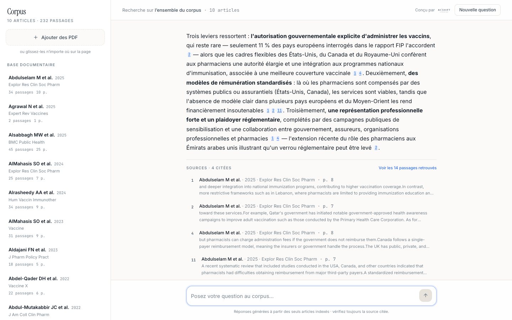
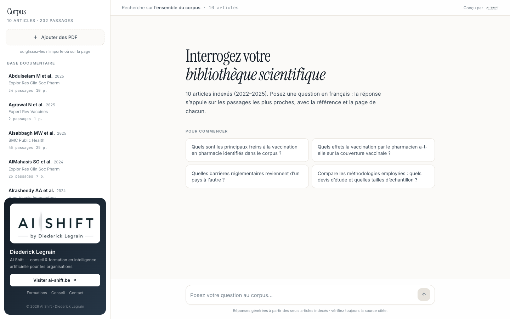
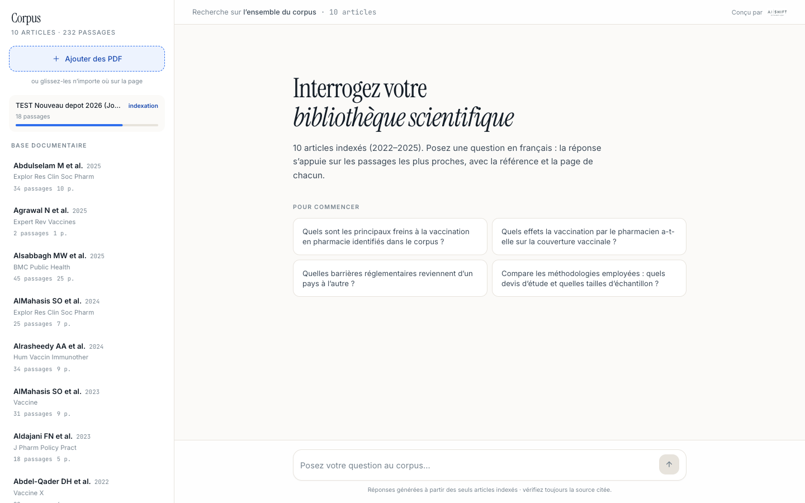
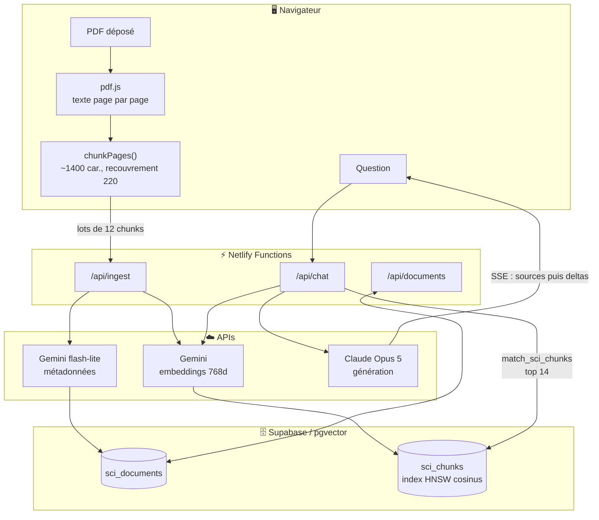

# Corpus — un chatbot RAG sur vos PDF, extensible par glisser-déposer

Un assistant qui répond en langage naturel à des questions sur une base documentaire PDF, **en
citant systématiquement la source et la page**. N'importe qui peut déposer un nouveau document sur
la page : il est lu, découpé, vectorisé et rejoint la base consultable en quelques secondes.

Le corpus de démonstration porte sur la **vaccination en pharmacie d'officine** (10 articles
scientifiques, 2022–2025), mais le code est écrit pour être re-pointé sur n'importe quel corpus —
voir [Adapter à un autre corpus](#adapter-à-un-autre-corpus).

**Démo en ligne : https://corpus-scientifique.netlify.app**



---

## Sommaire

- [Ce que ça fait](#ce-que-ça-fait)
- [Architecture](#architecture)
- [Stack et choix techniques](#stack-et-choix-techniques)
- [Démarrage rapide](#démarrage-rapide)
- [Le schéma SQL en détail](#le-schéma-sql-en-détail)
- [Les embeddings en détail](#les-embeddings-en-détail)
- [Le pipeline d'ingestion en détail](#le-pipeline-dingestion-en-détail)
- [Le pipeline de réponse en détail](#le-pipeline-de-réponse-en-détail)
- [API](#api)
- [Structure du dépôt](#structure-du-dépôt)
- [Adapter à un autre corpus](#adapter-à-un-autre-corpus)
- [Coûts](#coûts)
- [Limites connues](#limites-connues)

---

## Ce que ça fait

| | |
|---|---|
| **Répondre en citant** | Chaque affirmation porte un renvoi `[n]` cliquable qui pointe vers l'extrait exact utilisé, avec auteurs, année, revue et **numéro de page**. On peut aller vérifier dans le PDF d'origine. |
| **Refuser d'inventer** | Le prompt système interdit de sortir des extraits fournis. En test, le modèle signale spontanément qu'un chiffre est illisible dans l'extrait plutôt que de le combler. |
| **Accepter de nouveaux documents** | Glisser-déposer n'importe où sur la page. Progression réelle affichée, déduplication par nom de fichier, suppression avec cascade. |
| **Lire les métadonnées dans l'article** | Le titre, les auteurs, l'année et la revue sont extraits de l'en-tête du PDF, pas du nom de fichier. Un fichier mal nommé produit quand même une citation propre. |
| **Restreindre à un document** | Un clic dans la barre latérale limite la recherche à un seul article. |
| **Streamer la réponse** | SSE de bout en bout : le texte s'affiche au fil de la génération, les sources arrivent avant même le premier mot. |

<table>
<tr>
<td width="50%"></td>
<td width="50%"></td>
</tr>
<tr>
<td align="center"><em>Accueil — corpus indexé, suggestions de départ</em></td>
<td align="center"><em>Dépôt d'un PDF, progression réelle</em></td>
</tr>
</table>

---

## Architecture



**Le point non évident : l'extraction du PDF se fait dans le navigateur**, pas côté serveur. Le
front envoie du texte *déjà découpé*, par lots de 12 chunks. Trois raisons :

1. Pas d'upload de binaire de plusieurs Mo vers une function (limite de payload Netlify).
2. Chaque appel de function reste court — aucun risque de timeout, même sur un PDF de 100 pages :
   c'est la boucle côté client qui tient la durée totale, pas une requête unique.
3. La barre de progression est réelle, pas simulée : le client sait exactement où il en est.

Corollaire : le même chemin de code sert à l'indexation en masse. `scripts/seed-pdfs.mjs` extrait
le texte avec le build `legacy` de pdf.js sous Node, puis tape **la même API**. Rien à maintenir en
double, et lancer le seed valide au passage les endpoints de production.

C'est pour ça que `shared/` est en JavaScript simple : ces modules sont importés par les trois
mondes — navigateur (Vite), functions (esbuild), scripts Node.

---

## Stack et choix techniques

| Brique | Choix | Pourquoi |
|---|---|---|
| Front | Vite + React 19 + Tailwind v4 | Démarrage instantané, zéro configuration de build. |
| Backend | Netlify Functions (`.mts`) | Même déploiement que le front, routes `/api/*` déclarées dans le fichier de la function. |
| Vecteurs | Supabase + pgvector, index **HNSW** cosinus | HNSW plutôt qu'IVFFlat : pas de phase d'entraînement, correct dès le premier document inséré. |
| Embeddings | `gemini-embedding-001`, **768 dimensions** | Gère l'asymétrie question/passage (voir plus bas). 768 dims au lieu de 3072 : index plus léger, qualité indistinguable à cette échelle. |
| Métadonnées | `gemini-2.5-flash-lite`, schéma JSON contraint | Rapide et quasi gratuit pour un travail d'extraction structurée. |
| Génération | `claude-opus-5`, effort `low`, streaming | La synthèse d'articles demande de la finesse — distinguer un résultat établi d'une limite reconnue par les auteurs. L'effort bas garde la latence acceptable pour un chat. |
| PDF | `pdfjs-dist` v6 | Fonctionne à l'identique dans le navigateur (worker) et sous Node (build `legacy`). |

---

## Démarrage rapide

### Prérequis

- Node 22+
- Un projet [Supabase](https://supabase.com) (le plan gratuit suffit)
- Une clé [Google AI Studio](https://aistudio.google.com/apikey) (embeddings + métadonnées)
- Une clé [Anthropic](https://console.anthropic.com/settings/keys) (génération)
- Un compte [Netlify](https://netlify.com) pour le déploiement

### 1. Cloner et installer

```bash
git clone https://github.com/dlegrain/corpus-rag-chatbot.git
cd corpus-rag-chatbot
npm install
```

### 2. Créer les tables

Ouvrez le **SQL Editor** de votre projet Supabase et exécutez
[`supabase/schema.sql`](supabase/schema.sql) tel quel. Il crée l'extension `vector`, les deux
tables, l'index HNSW, la fonction de recherche et active la RLS.

### 3. Renseigner les variables d'environnement

```bash
cp .env.example .env
# puis remplir les 4 valeurs
```

> ⚠️ `SUPABASE_SERVICE_ROLE_KEY` contourne la RLS. Elle ne doit **jamais** atteindre le navigateur.
> Ici elle n'est lue que par les Netlify Functions ; le front ne connaît que `/api/*`.

### 4. Lancer en local

```bash
npx netlify dev        # front + functions sur http://localhost:8888
```

### 5. Constituer son corpus

Deux voies, strictement équivalentes (elles passent par la même API) :

- **Glisser-déposer** vos PDF sur la page ;
- **En masse**, pour un dossier entier :

```bash
mkdir pdfs && cp /chemin/vers/vos/*.pdf pdfs/
npm run seed -- --url http://localhost:8888

# ou directement contre la production :
npm run seed -- --url https://votre-site.netlify.app
```

> Le dossier `pdfs/` est volontairement **exclu du dépôt** (`.gitignore`) : les articles du corpus
> de démonstration sont soumis aux droits de leurs éditeurs. Mettez-y les vôtres.

### 6. Déployer

```bash
npx netlify sites:create --name mon-corpus
npx netlify env:set SUPABASE_URL "https://xxxx.supabase.co"
for CTX in production deploy-preview branch-deploy; do
  npx netlify env:set SUPABASE_SERVICE_ROLE_KEY "..." --secret --context $CTX
  npx netlify env:set GEMINI_API_KEY            "..." --secret --context $CTX
  npx netlify env:set ANTHROPIC_API_KEY         "..." --secret --context $CTX
done
npx netlify deploy --prod --build
```

> Deux pièges du CLI Netlify : `--secret` **exige** un `--context`, et plusieurs `--context` dans
> le même appel échouent — d'où la boucle.

---

## Le schéma SQL en détail

Fichier complet : [`supabase/schema.sql`](supabase/schema.sql).

```sql
create table public.sci_documents (
  id uuid primary key default gen_random_uuid(),
  title text not null, filename text not null,
  authors text, year int, journal text,
  n_pages int, n_chunks int not null default 0,
  status text not null default 'ready',      -- 'indexing' pendant l'ingestion
  created_at timestamptz not null default now()
);

create table public.sci_chunks (
  id bigserial primary key,
  document_id uuid not null references public.sci_documents(id) on delete cascade,
  chunk_index int not null,
  page int,                                   -- ← ce qui rend la citation vérifiable
  content text not null,
  embedding vector(768)
);

create index on public.sci_chunks using hnsw (embedding vector_cosine_ops);
```

Trois décisions à noter :

- **`on delete cascade`** — supprimer un document supprime ses vecteurs. Pas de nettoyage manuel.
- **`page` conservé sur chaque chunk** — c'est la colonne qui transforme « le modèle affirme » en
  « allez vérifier page 8 ». Sans elle, l'outil n'est pas utilisable par un public professionnel.
- **Préfixe `sci_`** — le projet Supabase de la démo héberge plusieurs applications. Préfixer évite
  toute collision. Renommez si vous partez d'un projet vierge (et pensez à `match_sci_chunks`).

### La fonction de recherche

```sql
create or replace function public.match_sci_chunks(
  query_embedding vector(768),
  match_count     int  default 10,
  filter_doc      uuid default null            -- restreindre à un seul document
)
returns table (id bigint, document_id uuid, content text, page int,
               similarity float, title text, authors text, year int,
               journal text, filename text)
language sql stable
set search_path = public
as $$
  select c.id, c.document_id, c.content, c.page,
         1 - (c.embedding <=> query_embedding) as similarity,
         d.title, d.authors, d.year, d.journal, d.filename
  from public.sci_chunks c
  join public.sci_documents d on d.id = c.document_id
  where filter_doc is null or c.document_id = filter_doc
  order by c.embedding <=> query_embedding
  limit match_count;
$$;
```

La jointure ramène les métadonnées **dans le même aller-retour** : une seule requête suffit pour
construire à la fois le contexte du modèle et la liste de sources affichée.

### Sécurité : RLS activée, zéro policy

```sql
alter table public.sci_documents enable row level security;
alter table public.sci_chunks    enable row level security;
revoke all on function public.match_sci_chunks(vector, int, uuid) from anon, authenticated;
```

RLS active **sans aucune policy** = la clé anon ne peut rien lire. Tout passe par les functions
avec la `service_role`, qui contourne la RLS. Aucun secret Supabase n'atteint le navigateur.

---

## Les embeddings en détail

Fichier : [`netlify/lib/embed.ts`](netlify/lib/embed.ts).

**Modèle** `gemini-embedding-001`, **768 dimensions** (`outputDimensionality: 768`).

### Asymétrie question / passage

Le même texte n'est pas encodé de la même façon selon qu'il sert de question ou de réponse
potentielle. Gemini expose ça via `taskType` — c'est le détail qui fait le plus de différence en
pratique quand les questions sont courtes et les passages longs :

| Moment | `taskType` | Fonction |
|---|---|---|
| Indexation | `RETRIEVAL_DOCUMENT` | `embedBatch()` |
| Recherche | `RETRIEVAL_QUERY` | `embedQuery()` |

### Normalisation

En dessous de 3072 dimensions, Google recommande de normaliser le vecteur à la main — la sortie
n'est plus unitaire. C'est fait systématiquement :

```ts
function normalize(v: number[]): number[] {
  const norm = Math.sqrt(v.reduce((s, x) => s + x * x, 0)) || 1
  return v.map((x) => x / norm)
}
```

La distance cosinus y est insensible, mais ça garde les vecteurs comparables si vous passez un jour
à un index en produit scalaire (`vector_ip_ops`).

### Lots

`embedBatch()` regroupe par **50 textes** par appel à `batchEmbedContents` (Gemini en accepte 100).
Une function traite au maximum 12 chunks à la fois, donc un seul appel Gemini par requête en
pratique — la boucle est là pour le cas où vous augmenteriez `BATCH`.

---

## Le pipeline d'ingestion en détail

### 1. Extraction — `src/lib/pdf.ts` (navigateur) et `scripts/seed-pdfs.mjs` (Node)

pdf.js est chargé **en import dynamique** : ses ~700 ko ne pèsent sur le bundle initial que si
l'utilisateur dépose effectivement un fichier.

Les sauts de ligne sont reconstruits à partir de la position verticale de chaque fragment
(`item.transform[5]`), sans quoi le texte d'un PDF à deux colonnes arrive en un seul bloc illisible.

> **Piège pdf.js v6** : `doc.destroy()` n'existe plus. Il faut conserver le `loadingTask` et
> appeler `task.destroy()`.

### 2. Découpage — `shared/chunk.js`

| Paramètre | Valeur | Rôle |
|---|---|---|
| `TARGET` | 1400 caractères | Taille visée d'un chunk. |
| `OVERLAP` | 220 caractères | Recouvrement, pour ne pas couper une conclusion en deux. |
| `MIN` | 120 caractères | En dessous, le fragment est fusionné avec le précédent. |

Le découpage est **page-aware** : on ne fusionne jamais deux pages dans un chunk, et le numéro de
page voyage avec le texte. Les coupes cherchent une frontière de phrase dans les 400 derniers
caractères avant de tomber sur une coupe brutale.

Le nettoyage supprime les espaces insécables et **recolle les césures de fin de ligne**
(`-\n` suivi d'une minuscule) — sinon « vacci-\nnation » devient deux jetons parasites.

### 3. Métadonnées — `netlify/lib/metadata.ts`

Les deux premières pages sont envoyées à `gemini-2.5-flash-lite` avec un `responseSchema` JSON
strict et `temperature: 0`. Le nom de fichier ne sert que de **repli**
(`shared/meta.js` sait lire le motif `Auteurs ANNÉE (Revue).pdf`).

Validé sur un cas volontairement piégeux : un PDF renommé
`TEST Nouveau depot 2026 (Journal Test).pdf` a été correctement identifié comme
*Aldajani FN et al. · 2023 · J Pharm Policy Pract*. Sans cette étape, un document déposé avec un
nom quelconque produirait des citations inutilisables.

### 4. Envoi par lots — `src/lib/api.ts`

```
POST /api/ingest  { op: "start",  docId, filename, nPages, sample }   → crée le document
POST /api/ingest  { op: "chunks", docId, chunks: [12 max] }           → embed + insert   (×N)
POST /api/ingest  { op: "finish", docId }                             → n_chunks, status
```

`op: "start"` vérifie d'abord si le `filename` existe déjà et renvoie `{ duplicate: true }` le cas
échéant : redéposer le même PDF ne crée pas de doublon.

---

## Le pipeline de réponse en détail

Fichiers : [`netlify/functions/chat.mts`](netlify/functions/chat.mts) et
[`netlify/lib/prompt.ts`](netlify/lib/prompt.ts).

1. **Embedding de la question** en `RETRIEVAL_QUERY`.
2. **`match_sci_chunks`**, `MATCH_COUNT = 14` passages (ou moins si un document est sélectionné).
3. **Émission immédiate des sources** en SSE — elles s'affichent avant le premier mot généré.
4. **Prompt système** : les extraits sont numérotés dans des balises
   `<extrait n="3" source="…" page="8">`, avec des règles explicites — ne rien affirmer hors des
   extraits, citer `[n]`, reprendre les chiffres à l'identique, distinguer un résultat d'une limite
   reconnue par les auteurs, dire franchement quand la réponse n'est pas dans le corpus.
5. **Streaming Claude** (`max_tokens: 4096`, effort `low`), 8 derniers messages d'historique.

Le front convertit les `[n]` en liens internes (`Message.tsx`) qui deviennent des pastilles
cliquables pointant vers l'extrait correspondant. Les extraits affichés sont recadrés par
`excerptOf()` : il repart de la première frontière de phrase si elle arrive dans les 140 premiers
caractères, sinon il jette le mot tronqué par le recouvrement.

Format SSE :

```
data: {"type":"sources","sources":[{"n":1,"title":…,"page":8,"similarity":0.71,"excerpt":…}]}
data: {"type":"delta","text":"L'intégration "}
data: {"type":"delta","text":"des pharmaciens…"}
data: {"type":"done"}
```

---

## API

| Route | Méthode | Corps / paramètres | Retour |
|---|---|---|---|
| `/api/chat` | `POST` | `{ messages: [{role, content}], docId?: string }` | Flux SSE (`sources`, `delta`, `done`, `error`) |
| `/api/ingest` | `POST` | `{ op: "start" \| "chunks" \| "finish", docId, … }` | JSON |
| `/api/documents` | `GET` | — | `{ documents: [...] }` |
| `/api/documents` | `DELETE` | `?id=<uuid>` | `{ deleted: id }` |

Les routes sont déclarées dans chaque function via `export const config = { path: '/api/…' }`.

---

## Structure du dépôt

```
├── src/                        Front React
│   ├── components/             Sidebar, Chat, Message, Sources, Composer, BrandCard…
│   ├── hooks/                  useDocuments (corpus + upload), useChat (SSE)
│   └── lib/                    pdf.ts (extraction), api.ts (appels), types.ts
├── netlify/
│   ├── functions/              chat.mts · ingest.mts · documents.mts  → routes /api/*
│   └── lib/                    embed.ts · supabase.ts · metadata.ts · prompt.ts
├── shared/                     chunk.js · meta.js   (navigateur + functions + scripts)
├── scripts/seed-pdfs.mjs       Indexation en masse d'un dossier via l'API
├── supabase/schema.sql         Tables, index HNSW, fonction de recherche, RLS
├── screenshots/                Captures du README
└── pdfs/                       Corpus source — non versionné
```

Convention appliquée : **un fichier = une responsabilité, ~200 lignes maximum**.

---

## Adapter à un autre corpus

Rien dans l'architecture n'est spécifique aux articles scientifiques. Le passage à un corpus
réglementaire, didactique ou interne se joue sur **cinq fichiers**, aucun ne dépassant quelques
dizaines de lignes.

### Les cinq points de bascule

| # | Fichier | Ce qu'on y change |
|---|---|---|
| 1 | [`netlify/lib/prompt.ts`](netlify/lib/prompt.ts) | Le prompt système : rôle, public visé, règles de citation, ton. **C'est le levier principal.** |
| 2 | [`netlify/lib/metadata.ts`](netlify/lib/metadata.ts) | Le `SCHEMA` JSON des métadonnées à extraire de l'en-tête, et la consigne d'extraction. |
| 3 | [`shared/chunk.js`](shared/chunk.js) | `TARGET` / `OVERLAP` selon la densité du document. |
| 4 | [`src/components/EmptyState.tsx`](src/components/EmptyState.tsx) | Les suggestions de départ et les textes d'accueil. |
| 5 | [`netlify/functions/chat.mts`](netlify/functions/chat.mts) | `MATCH_COUNT` : nombre de passages injectés. |

À quoi s'ajoutent, côté cosmétique : le `<title>` dans `index.html`, les libellés de
[`Sidebar.tsx`](src/components/Sidebar.tsx) (« Corpus », « Base documentaire ») et le bloc de marque
[`BrandCard.tsx`](src/components/BrandCard.tsx).

### Trois profils concrets

<details>
<summary><b>📕 Corpus réglementaire</b> — lois, arrêtés, normes, conventions collectives</summary>

<br>

Ce qui change par rapport au scientifique : la **granularité de la citation** devient l'article ou
l'alinéa, pas la page ; et la **date de version** compte plus que tout — un texte abrogé qui répond
avec assurance est pire que pas de réponse.

**1. Métadonnées** — remplacer auteurs/revue par la nature du texte et ses dates :

```ts
const SCHEMA = {
  type: 'object',
  properties: {
    title:        { type: 'string' },   // « Règlement (UE) 2016/679 »
    reference:    { type: 'string' },   // numéro officiel
    authority:    { type: 'string' },   // autorité émettrice
    date_effect:  { type: 'string' },   // entrée en vigueur
    version:      { type: 'string' },   // consolidée au…
  },
  required: ['title', 'reference', 'authority', 'date_effect', 'version'],
}
```

Ajoutez les colonnes correspondantes à `sci_documents` et à `match_sci_chunks`.

**2. Découpage** — un article de loi est une unité de sens : mieux vaut couper dessus que tous les
1400 caractères. Dans `chunkPages()`, remplacez le découpage par phrase par une coupe sur le motif
de numérotation :

```js
const ARTICLE = /\n(?=(Article|Art\.)\s+\d+)/g
```

Conservez le numéro d'article à la place de `page` dans le chunk.

**3. Prompt** — les règles à durcir :

```
- Cite toujours l'article et l'alinéa exacts, jamais une paraphrase de la règle.
- Précise systématiquement la version du texte et sa date d'entrée en vigueur.
- Si deux textes du corpus se contredisent, signale-le au lieu de trancher.
- Tu n'es pas juriste : ne conclus jamais sur l'application à un cas particulier,
  restitue la règle et ses conditions.
```

**4. `MATCH_COUNT`** — plutôt 18–20 : une question réglementaire croise souvent plusieurs textes.

</details>

<details>
<summary><b>📗 Corpus didactique</b> — supports de cours, manuels, procédures internes</summary>

<br>

Ici l'objectif n'est plus de restituer mais de **faire comprendre**. Le modèle a le droit de
reformuler, d'illustrer et de progresser du simple au complexe — ce qui est exactement interdit dans
les deux autres profils.

**1. Prompt** — inverser la contrainte :

```
Tu es un tuteur. Réponds à partir du support de cours, mais reformule dans tes mots,
donne un exemple concret, et termine par une question de vérification.
Signale ce qui n'est pas couvert par le support plutôt que de l'inventer.
Adapte le niveau : commence simple, approfondis si la personne relance.
```

**2. Découpage** — `TARGET: 2200`, `OVERLAP: 300`. Un chapitre pédagogique se comprend mal en
tranches de 1400 caractères : le contexte compte plus que la précision du renvoi.

**3. Métadonnées** — `{ module, chapter, level, objectives }` plutôt que `{ authors, year }`.

**4. Suggestions** — remplacer les questions de recherche par des amorces d'apprentissage :
« Explique-moi X comme si je débutais », « Quelle est la différence entre X et Y ? »,
« Donne-moi un exercice sur le chapitre 3 ».

</details>

<details>
<summary><b>📘 Corpus interne d'entreprise</b> — comptes rendus, offres, documentation projet</summary>

<br>

Le point critique n'est pas le prompt, c'est **l'accès** : le déploiement de démonstration est
public et sans authentification (voir [Limites connues](#limites-connues)).

**1. Authentification** — activer Supabase Auth et ajouter un garde en tête de chaque function :

```ts
const token = req.headers.get('Authorization')?.replace('Bearer ', '')
const { data: { user } } = await db().auth.getUser(token)
if (!user) return json({ error: 'unauthorized' }, 401)
```

**2. Cloisonnement** — ajouter `workspace_id` sur les deux tables, le propager en argument de
`match_sci_chunks`, et écrire de vraies policies RLS plutôt que de tout passer en `service_role`.

**3. Métadonnées** — `{ doc_type, project, author, date, confidentiality }`.

**4. Formats** — pour aller au-delà du PDF, `src/lib/pdf.ts` est le seul point à étendre : il suffit
de renvoyer un `string[]` (un élément par « page »), tout le reste du pipeline suit sans
modification. `mammoth` pour le `.docx`, `xlsx` pour les tableurs.

</details>

### Ce qu'il ne faut pas changer

- **L'extraction côté navigateur.** C'est ce qui garde les functions sous leur timeout quel que
  soit le volume.
- **L'asymétrie `RETRIEVAL_DOCUMENT` / `RETRIEVAL_QUERY`.** Gratuite, et elle porte une bonne part
  de la qualité de rappel.
- **Le champ de localisation dans le chunk** (`page`, ou article, ou horodatage). C'est la seule
  chose qui rend une réponse vérifiable — et donc utilisable.

---

## Coûts

Ordres de grandeur, hors offre gratuite :

| Opération | Coût |
|---|---|
| Indexer 10 articles (~230 chunks) | quelques centimes — les embeddings Gemini sont marginaux |
| Une question | ~0,05 $ (≈ 6 000 jetons d'entrée + 800 de sortie sur Claude Opus 5) |
| Stockage Supabase | négligeable — 232 vecteurs de 768 dims ≈ 700 ko |

Pour diviser le coût par question par ~5 : passer à `claude-sonnet-5` dans
[`chat.mts`](netlify/functions/chat.mts). La qualité de synthèse baisse un peu sur les questions
qui demandent de croiser plusieurs études.

---

## Limites connues

- **Aucune authentification.** Le déploiement de démonstration est public : n'importe quel visiteur
  peut ajouter ou supprimer des documents. Voir le profil « corpus interne » ci-dessus.
- **PDF scannés non gérés.** Sans couche texte, l'extraction renvoie du vide et l'ingestion
  échoue proprement (« Aucun texte extractible »). Il faudrait un OCR en amont.
- **Pas de reranking.** La recherche est purement vectorielle. Au-delà de quelques centaines de
  documents, un reranker ou une recherche hybride (BM25 + vecteur) deviendrait rentable.
- **Déduplication par nom de fichier.** Le même article sous deux noms différents entre deux fois.
- **Déploiement manuel** (`netlify deploy --prod --build`), pas de CI.

---

## Licence

[MIT](LICENSE) — réutilisez, modifiez, déployez librement.

---

<div align="center">

Conçu par **Diederick Legrain** · [AI Shift](https://ai-shift.be)

Conseil &amp; formation en intelligence artificielle pour les organisations

[ai-shift.be](https://ai-shift.be) · [LinkedIn](https://www.linkedin.com/in/dlegrain/)

</div>
