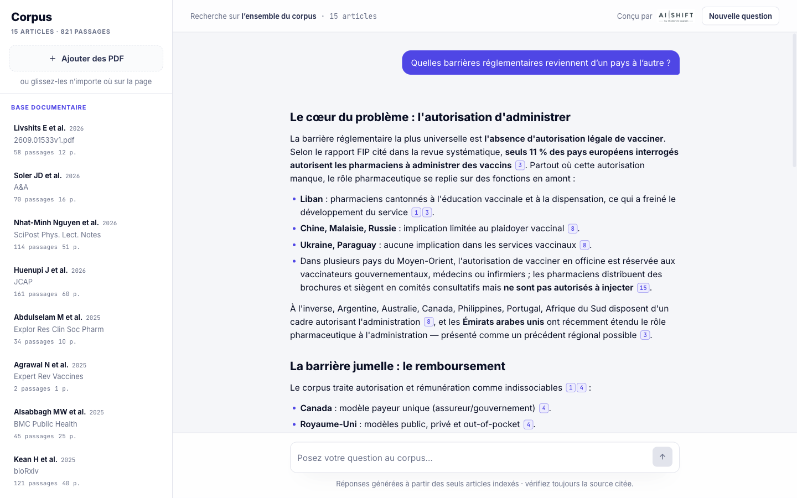
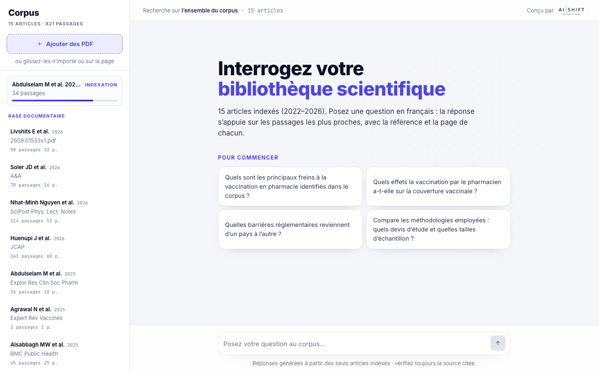
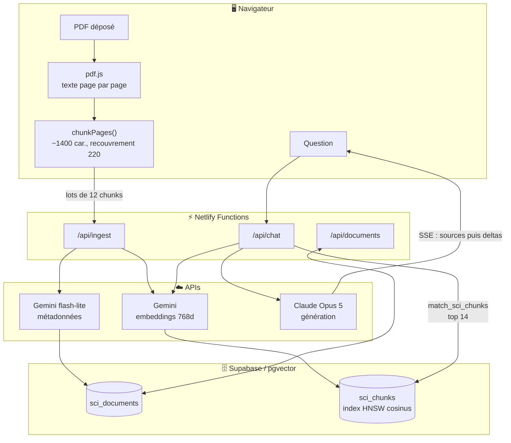

# Corpus — un chatbot RAG sur vos PDF, extensible par glisser-déposer

Un assistant qui répond en langage naturel à des questions sur une base documentaire PDF, **en
citant systématiquement la source et la page**. N'importe qui peut déposer un nouveau document sur
la page : il est lu, découpé, vectorisé et rejoint la base consultable en quelques secondes.

Le corpus de démonstration s'intitule **« Travailler avec l'IA, ce que dit la recherche »** :
13 articles de 2026 sur la collaboration entre humains et IA (et quelques risques des agents au
travail), tous sous licence CC BY ou CC BY-SA, interrogés par des professionnels qui ne sont pas
chercheurs. Le code est écrit pour être re-pointé sur n'importe quel corpus : voir
[Adapter à un autre corpus](#adapter-à-un-autre-corpus).

**Démo en ligne : https://corpus-scientifique.netlify.app**



---

## Sommaire

- [Ce que ça fait](#ce-que-ça-fait)
- [Architecture](#architecture)
- [Stack et choix techniques](#stack-et-choix-techniques)
- [Démarrage rapide](#démarrage-rapide)
- [Le schéma SQL en détail](#le-schéma-sql-en-détail)
- [Les embeddings en détail](#les-embeddings-en-détail)
- [Le pipeline d'ingestion en détail](#le-pipeline-dingestion-en-détail)
- [Le pipeline de réponse en détail](#le-pipeline-de-réponse-en-détail)
- [API](#api)
- [Structure du dépôt](#structure-du-dépôt)
- [Adapter à un autre corpus](#adapter-à-un-autre-corpus)
- [Coûts](#coûts)
- [Limites connues](#limites-connues)

---

## Ce que ça fait

| | |
|---|---|
| **Répondre en citant** | Chaque affirmation porte un renvoi `[n]` cliquable qui pointe vers l'extrait exact utilisé, avec auteurs, année, revue et **numéro de page**. On peut aller vérifier dans le PDF d'origine. |
| **Refuser d'inventer** | Le prompt système interdit de sortir des extraits fournis. En test, le modèle signale spontanément qu'un chiffre est illisible dans l'extrait plutôt que de le combler. |
| **Accepter de nouveaux documents** | Glisser-déposer n'importe où sur la page. Progression réelle affichée, déduplication par nom de fichier, suppression avec cascade. |
| **Lire les métadonnées dans l'article** | Le titre, les auteurs, l'année et la revue sont extraits de l'en-tête du PDF, pas du nom de fichier. Un fichier mal nommé produit quand même une citation propre. |
| **Restreindre à un ou plusieurs documents** | Cochez des documents dans la barre latérale : la recherche ne porte que sur eux. Rien de coché = tout le corpus. Le périmètre reste affiché en haut, et n'est pas conservé d'une visite à l'autre. |
| **Ouvrir la page citée** | Un clic sur « voir la page » ouvre le PDF d'origine à la page de la source, passage surligné, et permet de feuilleter. Le PDF est lu directement dans le stockage par un lien signé d'une heure. Réservé aux PDF déposés par `scripts/upload-pdfs.mjs` (ceux qu'on a le droit de rediffuser) : un document ajouté par glisser-déposer garde l'affichage de l'extrait. |
| **Streamer la réponse** | SSE de bout en bout : le texte s'affiche au fil de la génération, les sources arrivent avant même le premier mot. |

<table>
<tr>
<td width="50%"></td>
<td width="50%"></td>
</tr>
<tr>
<td align="center"><em>Accueil — corpus indexé, suggestions de départ</em></td>
<td align="center"><em>Dépôt d'un PDF, progression réelle</em></td>
</tr>
</table>

---

## Architecture



**Le point non évident : l'extraction du PDF se fait dans le navigateur**, pas côté serveur. Le
front envoie du texte *déjà découpé*, par lots de 12 chunks. Trois raisons :

1. Pas d'upload de binaire de plusieurs Mo vers une function (limite de payload Netlify).
2. Chaque appel de function reste court — aucun risque de timeout, même sur un PDF de 100 pages :
   c'est la boucle côté client qui tient la durée totale, pas une requête unique.
3. La barre de progression est réelle, pas simulée : le client sait exactement où il en est.

Corollaire : le même chemin de code sert à l'indexation en masse. `scripts/seed-pdfs.mjs` extrait
le texte avec le build `legacy` de pdf.js sous Node, puis tape **la même API**. Rien à maintenir en
double, et lancer le seed valide au passage les endpoints de production.

C'est pour ça que `shared/` est en JavaScript simple : ces modules sont importés par les trois
mondes — navigateur (Vite), functions (esbuild), scripts Node.

---

## Stack et choix techniques

| Brique | Choix | Pourquoi |
|---|---|---|
| Front | Vite + React 19 + Tailwind v4 | Démarrage instantané, zéro configuration de build. |
| Backend | Netlify Functions (`.mts`) | Même déploiement que le front, routes `/api/*` déclarées dans le fichier de la function. |
| Vecteurs | Supabase + pgvector, index **HNSW** cosinus | HNSW plutôt qu'IVFFlat : pas de phase d'entraînement, correct dès le premier document inséré. |
| Embeddings | `gemini-embedding-001`, **768 dimensions** | Gère l'asymétrie question/passage (voir plus bas). 768 dims au lieu de 3072 : index plus léger, qualité indistinguable à cette échelle. |
| Métadonnées | `gemini-2.5-flash-lite`, schéma JSON contraint | Rapide et quasi gratuit pour un travail d'extraction structurée. |
| Génération | `claude-opus-5`, effort `low`, streaming | La synthèse d'articles demande de la finesse — distinguer un résultat établi d'une limite reconnue par les auteurs. L'effort bas garde la latence acceptable pour un chat. |
| PDF | `pdfjs-dist` v6 | Fonctionne à l'identique dans le navigateur (worker) et sous Node (build `legacy`). |

---

## Démarrage rapide

### Prérequis

- Node 22+
- Un projet [Supabase](https://supabase.com) (le plan gratuit suffit)
- Une clé [Google AI Studio](https://aistudio.google.com/apikey) (embeddings + métadonnées)
- Une clé [Anthropic](https://console.anthropic.com/settings/keys) (génération)
- Un compte [Netlify](https://netlify.com) pour le déploiement

### 1. Cloner et installer

```bash
git clone https://github.com/dlegrain/corpus-rag-chatbot.git
cd corpus-rag-chatbot
npm install
```

### 2. Créer les tables

Ouvrez le **SQL Editor** de votre projet Supabase et exécutez
[`supabase/schema.sql`](supabase/schema.sql) tel quel. Il crée l'extension `vector`, les deux
tables, l'index HNSW, les fonctions de recherche et active la RLS.

**Plusieurs corpus dans une même base** : les noms sont préfixés (`sci_documents`,
`match_sci_chunks`…). Pour un second corpus, remplacez `sci` par un autre préfixe dans le
schéma, puis posez `CORPUS_PREFIX=<préfixe>` dans l'environnement du déploiement concerné. Sans
cette variable, c'est `sci`.

**Ouvrir la page citée (facultatif)** : créez un bucket Storage **privé** nommé
`<préfixe>-pdfs` (par exemple `sci-pdfs`), puis déposez-y les PDF d'origine avec
`node --env-file=.env scripts/upload-pdfs.mjs --dir pdfs`. Sans bucket, l'interface affiche
simplement l'extrait.

### 3. Renseigner les variables d'environnement

```bash
cp .env.example .env
# puis remplir les 4 valeurs
```

> ⚠️ `SUPABASE_SERVICE_ROLE_KEY` contourne la RLS. Elle ne doit **jamais** atteindre le navigateur.
> Ici elle n'est lue que par les Netlify Functions ; le front ne connaît que `/api/*`.

### 4. Lancer en local

```bash
npx netlify dev        # front + functions sur http://localhost:8888
```

### 5. Constituer son corpus

Deux voies, strictement équivalentes (elles passent par la même API) :

- **Glisser-déposer** vos PDF sur la page ;
- **En masse**, pour un dossier entier :

```bash
mkdir pdfs && cp /chemin/vers/vos/*.pdf pdfs/
npm run seed -- --url http://localhost:8888

# ou directement contre la production :
npm run seed -- --url https://votre-site.netlify.app
```

> Le dossier `pdfs/` est volontairement **exclu du dépôt** (`.gitignore`) : les articles du corpus
> de démonstration sont soumis aux droits de leurs éditeurs. Mettez-y les vôtres.

### 6. Déployer

```bash
npx netlify sites:create --name mon-corpus
npx netlify env:set SUPABASE_URL "https://xxxx.supabase.co"
for CTX in production deploy-preview branch-deploy; do
  npx netlify env:set SUPABASE_SERVICE_ROLE_KEY "..." --secret --context $CTX
  npx netlify env:set GEMINI_API_KEY            "..." --secret --context $CTX
  npx netlify env:set ANTHROPIC_API_KEY         "..." --secret --context $CTX
done
npx netlify deploy --prod --build
```

> Deux pièges du CLI Netlify : `--secret` **exige** un `--context`, et plusieurs `--context` dans
> le même appel échouent — d'où la boucle.

---

## Le schéma SQL en détail

Fichier complet : [`supabase/schema.sql`](supabase/schema.sql).

```sql
create table public.sci_documents (
  id uuid primary key default gen_random_uuid(),
  title text not null, filename text not null,
  authors text, year int, journal text,
  n_pages int, n_chunks int not null default 0,
  status text not null default 'ready',      -- 'indexing' pendant l'ingestion
  created_at timestamptz not null default now()
);

create table public.sci_chunks (
  id bigserial primary key,
  document_id uuid not null references public.sci_documents(id) on delete cascade,
  chunk_index int not null,
  page int,                                   -- ← ce qui rend la citation vérifiable
  content text not null,
  embedding vector(768)
);

create index on public.sci_chunks using hnsw (embedding vector_cosine_ops);
```

Trois décisions à noter :

- **`on delete cascade`** — supprimer un document supprime ses vecteurs. Pas de nettoyage manuel.
- **`page` conservé sur chaque chunk** — c'est la colonne qui transforme « le modèle affirme » en
  « allez vérifier page 8 ». Sans elle, l'outil n'est pas utilisable par un public professionnel.
- **Préfixe `sci_`** — le projet Supabase de la démo héberge plusieurs applications. Préfixer évite
  toute collision. Renommez si vous partez d'un projet vierge (et pensez à `match_sci_chunks`).

### La fonction de recherche

```sql
create or replace function public.match_sci_chunks(
  query_embedding vector(768),
  match_count     int  default 10,
  filter_doc      uuid default null            -- restreindre à un seul document
)
returns table (id bigint, document_id uuid, content text, page int,
               similarity float, title text, authors text, year int,
               journal text, filename text)
language sql stable
set search_path = public
as $$
  select c.id, c.document_id, c.content, c.page,
         1 - (c.embedding <=> query_embedding) as similarity,
         d.title, d.authors, d.year, d.journal, d.filename
  from public.sci_chunks c
  join public.sci_documents d on d.id = c.document_id
  where filter_doc is null or c.document_id = filter_doc
  order by c.embedding <=> query_embedding
  limit match_count;
$$;
```

La jointure ramène les métadonnées **dans le même aller-retour** : une seule requête suffit pour
construire à la fois le contexte du modèle et la liste de sources affichée.

### Le rappel des passages déjà cités

```sql
create or replace function public.sci_chunks_by_ids(
  ids             bigint[],
  query_embedding vector(768)                  -- pour scorer, pas pour chercher
)
returns table (id bigint, document_id uuid, content text, page int,
               similarity float, title text, authors text, year int,
               journal text, filename text)
language sql stable
set search_path = public
as $$
  select c.id, c.document_id, c.content, c.page,
         1 - (c.embedding <=> query_embedding) as similarity,
         d.title, d.authors, d.year, d.journal, d.filename
  from public.sci_chunks c
  join public.sci_documents d on d.id = c.document_id
  where c.id = any(ids);
$$;
```

Même forme de retour que la précédente, mais on récupère des passages **connus** au lieu d'en
chercher de nouveaux. L'embedding sert uniquement à leur attribuer une similarité avec la question
courante, ce qui permet d'écarter ceux qui ne sont plus pertinents (voir « La conversation »).

### Sécurité : RLS activée, zéro policy

```sql
alter table public.sci_documents enable row level security;
alter table public.sci_chunks    enable row level security;
revoke all on function public.match_sci_chunks(vector, int, uuid) from anon, authenticated;
revoke all on function public.sci_chunks_by_ids(bigint[], vector) from anon, authenticated;
grant  execute on function public.sci_chunks_by_ids(bigint[], vector) to service_role;
```

RLS active **sans aucune policy** = la clé anon ne peut rien lire. Tout passe par les functions
avec la `service_role`, qui contourne la RLS. Aucun secret Supabase n'atteint le navigateur.

---

## Les embeddings en détail

Fichier : [`netlify/lib/embed.ts`](netlify/lib/embed.ts).

**Modèle** `gemini-embedding-001`, **768 dimensions** (`outputDimensionality: 768`).

### Asymétrie question / passage

Le même texte n'est pas encodé de la même façon selon qu'il sert de question ou de réponse
potentielle. Gemini expose ça via `taskType` — c'est le détail qui fait le plus de différence en
pratique quand les questions sont courtes et les passages longs :

| Moment | `taskType` | Fonction |
|---|---|---|
| Indexation | `RETRIEVAL_DOCUMENT` | `embedBatch()` |
| Recherche | `RETRIEVAL_QUERY` | `embedQuery()` |

### Normalisation

En dessous de 3072 dimensions, Google recommande de normaliser le vecteur à la main — la sortie
n'est plus unitaire. C'est fait systématiquement :

```ts
function normalize(v: number[]): number[] {
  const norm = Math.sqrt(v.reduce((s, x) => s + x * x, 0)) || 1
  return v.map((x) => x / norm)
}
```

La distance cosinus y est insensible, mais ça garde les vecteurs comparables si vous passez un jour
à un index en produit scalaire (`vector_ip_ops`).

### Lots

`embedBatch()` regroupe par **50 textes** par appel à `batchEmbedContents` (Gemini en accepte 100).
Une function traite au maximum 12 chunks à la fois, donc un seul appel Gemini par requête en
pratique — la boucle est là pour le cas où vous augmenteriez `BATCH`.

---

## Le pipeline d'ingestion en détail

### 1. Extraction — `src/lib/pdf.ts` (navigateur) et `scripts/seed-pdfs.mjs` (Node)

pdf.js est chargé **en import dynamique** : ses ~700 ko ne pèsent sur le bundle initial que si
l'utilisateur dépose effectivement un fichier.

Les sauts de ligne sont reconstruits à partir de la position verticale de chaque fragment
(`item.transform[5]`), sans quoi le texte d'un PDF à deux colonnes arrive en un seul bloc illisible.

> **Piège pdf.js v6** : `doc.destroy()` n'existe plus. Il faut conserver le `loadingTask` et
> appeler `task.destroy()`.

**Ce que cette étape ne sait pas faire.** `getTextContent()` ne rend que des caractères : les
figures n'existent pas pour elle, et les tableaux perdent leur structure. C'est la limite la plus
sérieuse du système — détaillée dans « Limites connues », et le chantier n°2 de la feuille de route.

### 2. Découpage — `shared/chunk.js`

| Paramètre | Valeur | Rôle |
|---|---|---|
| `TARGET` | 1400 caractères | Taille visée d'un chunk. |
| `OVERLAP` | 220 caractères | Recouvrement, pour ne pas couper une conclusion en deux. |
| `MIN` | 120 caractères | En dessous, le fragment est fusionné avec le précédent. |

Le découpage est **page-aware** : on ne fusionne jamais deux pages dans un chunk, et le numéro de
page voyage avec le texte. Les coupes cherchent une frontière de phrase dans les 400 derniers
caractères avant de tomber sur une coupe brutale.

Le nettoyage supprime les espaces insécables et **recolle les césures de fin de ligne**
(`-\n` suivi d'une minuscule) — sinon « vacci-\nnation » devient deux jetons parasites.

### 3. Métadonnées — `netlify/lib/metadata.ts`

Les deux premières pages sont envoyées à `gemini-2.5-flash-lite` avec un `responseSchema` JSON
strict et `temperature: 0`. Le nom de fichier ne sert que de **repli**
(`shared/meta.js` sait lire le motif `Auteurs ANNÉE (Revue).pdf`).

Validé sur un cas volontairement piégeux : un PDF renommé
`TEST Nouveau depot 2026 (Journal Test).pdf` a été correctement identifié comme
*Aldajani FN et al. · 2023 · J Pharm Policy Pract*. Sans cette étape, un document déposé avec un
nom quelconque produirait des citations inutilisables.

### 4. Envoi par lots — `src/lib/api.ts`

```
POST /api/ingest  { op: "start",  docId, filename, nPages, sample }   → crée le document
POST /api/ingest  { op: "chunks", docId, chunks: [12 max] }           → embed + insert   (×N)
POST /api/ingest  { op: "finish", docId }                             → n_chunks, status
```

`op: "start"` vérifie d'abord si le `filename` existe déjà et renvoie `{ duplicate: true }` le cas
échéant : redéposer le même PDF ne crée pas de doublon.

---

## Le pipeline de réponse en détail

Fichiers : [`netlify/functions/chat.mts`](netlify/functions/chat.mts) et les modules de
[`netlify/lib/`](netlify/lib) — `history`, `catalog`, `plan`, `retrieve`, `prompt`.

1. **Assainissement de l'historique** (`history.ts`) : les messages vides sont écartés et la
   fenêtre glissante garantit un `user` en tête — l'API Messages refuse les deux.
2. **Catalogue** (`catalog.ts`) : la liste des documents indexés, qui sert deux fois.
3. **Plan de recherche** (`plan.ts`) : un appel court à `claude-haiku-4-5` en sortie structurée,
   qui rend 0 à 3 requêtes, chacune avec un document cible optionnel. Voir « La conversation ».
4. **Recherches en parallèle** (`retrieve.ts`) : un embedding `RETRIEVAL_QUERY` et un
   `match_sci_chunks` par requête, budget réparti (1 requête → 20 passages, 2 → 12, 3 → 9,
   plafond global 24), **plafond par article** pour qu'un document long ne rafle pas toutes les
   places, puis fusion en gardant le meilleur score par passage.
5. **Rappel des passages déjà cités**, filtré par pertinence, puis **numérotation stable**.
6. **Émission immédiate des sources** en SSE — elles s'affichent avant le premier mot généré.
7. **Prompt système** (`prompt.ts`) : le catalogue, puis les extraits numérotés dans des balises
   `<extrait n="3" source="…" page="8">`, séparés en deux sections étiquetées (retrouvés pour la
   question courante / déjà cités plus haut). Règles explicites — ne rien inventer, citer `[n]`,
   reprendre les chiffres à l'identique, distinguer un résultat d'une limite reconnue par les
   auteurs, dire franchement quand la réponse n'est pas dans le corpus.
8. **Streaming Claude** (`claude-opus-5`, `max_tokens: 4096`, effort `low`).

Le front convertit les `[n]` en liens internes (`Message.tsx`) qui deviennent des pastilles
cliquables pointant vers l'extrait correspondant. Les extraits affichés sont recadrés par
`excerptOf()` : il repart de la première frontière de phrase si elle arrive dans les 140 premiers
caractères, sinon il jette le mot tronqué par le recouvrement.

Format SSE :

```
data: {"type":"plan","queries":[{"q":"barriers pharmacist-led vaccination","doc":null}]}
data: {"type":"sources","sources":[{"id":812,"n":1,"title":…,"page":8,"similarity":0.71,"excerpt":…}]}
data: {"type":"delta","text":"L'intégration "}
data: {"type":"delta","text":"des pharmaciens…"}
data: {"type":"done"}
```

---

## La conversation

Un RAG naïf est mono-tour : il cherche à partir du dernier message, remplace tout son contexte
documentaire à chaque question, et interdit au modèle de répondre hors des extraits du moment. Le
symptôme apparaît vers le troisième tour — l'utilisateur passe aux relances courtes (« et chez les
plus de 65 ans ? »), la recherche n'a plus de quoi s'accrocher, et l'assistant paraît amnésique.
Il ne l'est pas : l'historique est bien transmis, c'est le contexte documentaire qui a disparu.

Quatre mécanismes y répondent, pour un seul appel de modèle supplémentaire.

**Le plan de recherche** ([`plan.ts`](netlify/lib/plan.ts)). Avant de chercher, un appel court à
`claude-haiku-4-5` reçoit la conversation et le catalogue, et rend un JSON contraint :

```json
{ "queries": [ { "q": "freins à la vaccination en pharmacie", "doc": null },
               { "q": "freins à la vaccination", "doc": "<uuid de l'article visé>" } ] }
```

Ce seul objet règle quatre choses : la requête devient autoportante ; une comparaison entre deux
articles produit **une requête par côté**, chacune filtrée sur son document, ce qu'une recherche
unique ne fait jamais (le vecteur moyen est dominé par un seul des deux) ; « compare à Alden 2022 »
se résout en identifiant grâce au catalogue ; et `queries: []` signale les tours qui n'appellent
aucune recherche — « merci », ou une question portant sur les seules métadonnées du corpus. Un
document sélectionné dans la barre latérale prime toujours sur le plan. En cas d'échec, repli
silencieux sur la question brute.

**Le rappel conditionnel** ([`retrieve.ts`](netlify/lib/retrieve.ts)). Les passages **réellement
cités** dans les réponses précédentes sont rechargés et rescorés contre la question courante. Le
seuil est **relatif** : un passage rappelé moins pertinent que le plus faible des passages frais
est écarté. Sans ce filtre, on troquerait l'amnésie contre une fixation — le modèle continuerait
de répondre avec la matière du tour précédent. Avec, un changement de sujet les évince seul.

**La numérotation stable.** Les numéros de citation sont attribués une fois pour toute la
conversation : `[3]` désigne la même source au sixième tour qu'au premier. Le client renvoie la
table `id → n` déjà attribuée, le serveur la prolonge. Sans cela, les réponses déjà affichées se
mettent à pointer ailleurs. Les ancres HTML sont préfixées par l'index du message, une même source
pouvant être listée sous deux réponses.

**Les règles du prompt.** Le modèle est explicitement autorisé à s'appuyer sur ce qu'il a établi
plus haut dans l'échange, sans avoir à le re-sourcer. L'interdiction d'inventer, elle, ne bouge pas.

**La diversité des sources.** Un article long a mécaniquement plus de tickets à la loterie du
top-k, alors que sa longueur ne dit rien de sa pertinence. Sur ce corpus, deux articles hors sujet
pèsent 45 % des passages, et deux articles n'en ont qu'un ou deux — inatteignables. Sans plafond
par document, la mesure donnait **8 passages sur 14 issus du même article** et deux tours sur
treize ne citant qu'une seule source. La recherche sur-échantillonne donc (3× le budget) et
plafonne par article, en complétant sans plafond s'il ne reste pas assez d'articles pertinents.
Une requête qui vise explicitement un document en est exemptée, et une requête libre écarte les
documents qu'une requête ciblée du même plan couvre déjà — sinon les deux côtés d'une comparaison
se confondent.

---

## Évaluation

Deux outils, tous deux fondés sur de vrais appels — aucun mock.

[`scripts/test-chat.mjs`](scripts/test-chat.mjs) rejoue quatre conversations : relance
pronominale, changement de sujet, comparaison entre deux articles, six tours d'affilée. Il vérifie
douze assertions (plan autoportant, éviction des passages devenus hors sujet, deux côtés
représentés dans une comparaison, aucune erreur d'API, aucun gabarit de consigne recopié) et
publie un bilan : articles par réponse, concentration maximale sur un article, articles réellement
cités, secondes par tour.

[`scripts/juge.mjs`](scripts/juge.mjs) compare deux transcriptions **par paires et à l'aveugle** :
les deux réponses à une même question sont présentées en A/B dans un ordre tiré au sort, et le juge
ignore quelle version est laquelle. C'est ce qui a permis d'identifier que la diversification seule
ne suffisait pas — le juge préférait systématiquement la version mobilisant le plus de références
distinctes, ce qui a conduit à relever le budget de passages.

```bash
node scripts/test-chat.mjs                       # contre netlify dev
node scripts/test-chat.mjs 3                     # un seul scénario
DUMP=avant.json node scripts/test-chat.mjs       # capture les transcriptions
node scripts/juge.mjs avant.json apres.json      # comparaison à l'aveugle
```

**Limite assumée de ce dispositif** : treize paires par comparaison, un seul passage par
configuration. Les verdicts individuels du juge se sont montrés instables d'un passage à l'autre —
seul l'agrégat et le critère décisif récurrent sont exploitables. Pour trancher des écarts plus
fins, il faudrait une trentaine de questions et plusieurs passages moyennés.

### Résultats mesurés

Point de départ : le RAG mono-tour d'origine. Point d'arrivée : la version décrite ci-dessus.

| | Avant | Après |
|---|---|---|
| Articles mobilisés par réponse (corpus de 12) | 3,2 | **4,1 – 5,1** |
| Passages issus du même article (sur ~14) | 8,2 | **5,6** en recherche libre |
| Articles réellement cités | 2,5 | 2,9 |
| Assertions du banc d'essai | 8 / 11 | **12 / 12** |
| Juge A/B aveugle | — | **8 – 5** en faveur de la nouvelle version |

Le chemin compte autant que le résultat. Trois passages du juge, dans l'ordre :

1. **Diversification seule, à budget constant → 6–6, match nul.** Le critère décisif du juge était
   invariablement « mobilise plus de références distinctes ». Plafonner le volume à 16 passages
   avait payé l'équilibre gagné en largeur perdue. *La diversité répartit les places, elle n'en
   crée pas.*
2. **Budget relevé à 20/12/9, plafond global 24 → 8–5.** C'était le vrai levier.
3. **Ajout de la règle de croisement des articles → 8–5**, articles cités de 2,7 à 2,9. Neutre à
   légèrement positif.

Deux mesures qui ont orienté le travail plus que n'importe quelle intuition :

- **La distribution des passages par article est très inégale** — 121, 66, 45, 34, 34, 31, 25, 22,
  20, 18, 2, 1. Les deux plus gros documents sont hors sujet et pèsent 45 % du corpus, tandis que
  deux articles (2 et 1 passages) sont structurellement inatteignables dans un top-k. C'est ce qui
  a motivé le plafond par article.
- **La concentration ne se mesure que sur les tours à recherche libre.** Sur les tours où une
  requête cible explicitement un article, une concentration élevée est le comportement voulu — le
  mécanisme même de la comparaison. Mélanger les deux dans une moyenne masque le défaut réel.

> `netlify dev` n'injecte pas dans les fonctions les variables marquées *secret* côté site, et les
> masque même quand le `.env` local les définit. Utilisez `netlify dev --offline` pour que le
> `.env` reprenne la main.

---

## API

| Route | Méthode | Corps / paramètres | Retour |
|---|---|---|---|
| `/api/chat` | `POST` | `{ messages: [{role, content}], docIds?: string[] }` | Flux SSE (`sources`, `delta`, `done`, `error`) |
| `/api/ingest` | `POST` | `{ op: "start" \| "chunks" \| "finish", docId, … }` | JSON |
| `/api/documents` | `GET` | — | `{ documents: [...] }` |
| `/api/documents` | `DELETE` | `?id=<uuid>` | `{ deleted: id }` |

Les routes sont déclarées dans chaque function via `export const config = { path: '/api/…' }`.

---

## Structure du dépôt

```
├── src/                        Front React
│   ├── ai-shift/               tokens.css + police Inter : les valeurs du thème
│   ├── components/             Sidebar, Chat, Message, Sources, Composer, BrandCard…
│   ├── hooks/                  useDocuments (corpus + upload), useChat (SSE + mémoire)
│   └── lib/                    pdf.ts (extraction), api.ts, types.ts, citations.ts
├── netlify/
│   ├── functions/              chat.mts · ingest.mts · documents.mts · pdf.mts  → routes /api/*
│   └── lib/                    embed · supabase · metadata · history · catalog
│                               plan (planificateur) · retrieve (recherche) · prompt
├── shared/                     (navigateur + functions + scripts)
│   ├── domaine.js              ★ LE SUJET DU CHATBOT — le seul fichier à changer
│   ├── domaine.exemple.js      Gabarit commenté, à copier sur le précédent
│   └── chunk.js · meta.js      Découpage et métadonnées
├── scripts/seed-pdfs.mjs       Indexation en masse d'un dossier via l'API (--batch 6 si lent)
├── scripts/upload-pdfs.mjs     Dépôt des PDF d'origine pour l'ouverture à la page citée
├── scripts/scenarios.mjs       Les conversations du banc d'essai — à adapter
├── scripts/test-chat.mjs       Banc d'essai des conversations multi-tours
├── scripts/juge.mjs            Comparaison A/B aveugle de deux jeux de réponses
├── supabase/schema.sql         Tables, index HNSW, fonction de recherche, RLS
├── screenshots/                Captures du README
└── pdfs/                       Corpus source — non versionné
```

Convention appliquée : **un fichier = une responsabilité, ~200 lignes maximum**.

---

## Adapter à un autre corpus

Rien dans l'architecture n'est spécifique aux articles scientifiques. Le sujet du chatbot tient
dans **un seul fichier de code**, [`shared/domaine.js`](shared/domaine.js) — qui ne contient aucune
logique, uniquement des phrases.

```bash
cp shared/domaine.exemple.js shared/domaine.js   # puis remplissez
```

Le gabarit est commenté ligne à ligne, avec un exemple rempli pour un corpus de procédures RH.

### 1. Le sujet — `shared/domaine.js`

| Clé | Ce que ça change |
|---|---|
| `role` | Qui est l'assistant, à qui il parle. **Le levier le plus puissant du système.** |
| `natureDuCorpus` | Comment le corpus est décrit au planificateur de recherche et au juge. |
| `unite` / `unitePluriel` | Le mot pour une unité documentaire : « article », « texte », « procédure ». |
| `langueDocuments` | Consigne de langue, si les documents ne sont pas dans celle des utilisateurs. **Laisser vide sinon** : une consigne fausse dégrade silencieusement la recherche à chaque question. |
| `reglesMetier` | Ce qui fait une bonne réponse dans votre domaine. |
| `accueilTitre`, `suggestions` | L'écran d'accueil et les questions proposées au premier lancement. |

Ces valeurs alimentent le prompt de génération, le planificateur, l'écran d'accueil et le banc
d'essai. Aucun autre fichier de code n'a besoin d'être touché pour changer de sujet.

### 2. Les trois réglages techniques

Indépendants du sujet, ils dépendent de la **forme** de vos documents.

| Fichier | Réglage |
|---|---|
| [`netlify/lib/metadata.ts`](netlify/lib/metadata.ts) | Le `SCHEMA` JSON des métadonnées à extraire de l'en-tête, et la consigne d'extraction. |
| [`shared/chunk.js`](shared/chunk.js) | `TARGET` / `OVERLAP` selon la densité du document. |
| [`netlify/lib/retrieve.ts`](netlify/lib/retrieve.ts) | `BUDGET` et `TOTAL` : combien de passages sont envoyés au modèle. Plus haut = réponses mieux ancrées, coût plus élevé. |

### 3. L'identité visuelle

Le thème livré est le **design system AI Shift** : une seule couleur choisie (un indigo), Inter,
des cartes bordées plutôt que teintées. Il tient en deux fichiers :

- [`src/ai-shift/tokens.css`](src/ai-shift/tokens.css) — les valeurs : couleurs, rayons, ombres, et
  la police Inter embarquée dans [`fonts/`](src/ai-shift/fonts/).
- [`src/index.css`](src/index.css) — le bloc `@theme inline`, qui donne à chaque jeton un nom
  d'utilitaire Tailwind v4 (`bg-paper`, `text-ink`, `border-line`…). Il n'y a pas de fichier de
  configuration séparé.

```css
/* src/ai-shift/tokens.css */
:root {
  --accent:      #4f46e5;   /* citations, liens, boutons, surtitres */
  --accent-deep: #3b36ac;   /* survol, bout sombre du dégradé */
  --accent-soft: #edecfd;   /* fond des renvois [n], de la ligne sélectionnée */
  --bg:          #f5f6f9;   /* fond de page */
  --fg:          #0b1026;   /* texte principal */
  /* … */
}
```

**Changez ces valeurs pour donner au chatbot votre propre identité** : les trois `--accent*`
font l'essentiel du travail. Les composants n'écrivent jamais une couleur en dur, ils passent tous
par les utilitaires ci-dessus — tout suit d'un coup. Le rendu des réponses (titres, listes,
tableaux, renvois `[n]`) est dans [`src/prose.css`](src/prose.css).

S'y ajoutent le `<title>` dans [`index.html`](index.html), les libellés de
[`Sidebar.tsx`](src/components/Sidebar.tsx) (« Corpus », « Base documentaire ») et le pied de page.

> ⚠️ **Le thème et [`BrandCard.tsx`](src/components/BrandCard.tsx) portent ma marque** — couleurs
> AI Shift, nom, logos et lien vers ai-shift.be. La licence MIT couvre le code, pas mon identité :
> avant de publier sous votre nom, changez au minimum les `--accent*`, remplacez `BrandCard` par
> votre propre signature (ou retirez-le), et supprimez les logos de [`public/`](public/).

### 4. Vérifier que ça marche encore

Réécrivez les questions de [`scripts/scenarios.mjs`](scripts/scenarios.mjs) pour vos documents. Les
quatre scénarios testent des **mécanismes** — relance elliptique, changement de sujet, comparaison,
robustesse sur six tours — pas un sujet : gardez la forme, changez les questions. Puis lancez le
banc d'essai décrit au chapitre « Évaluation ».

### Trois profils concrets

<details>
<summary><b>📕 Corpus réglementaire</b> — lois, arrêtés, normes, conventions collectives</summary>

<br>

Ce qui change par rapport au scientifique : la **granularité de la citation** devient l'article ou
l'alinéa, pas la page ; et la **date de version** compte plus que tout — un texte abrogé qui répond
avec assurance est pire que pas de réponse.

**1. Métadonnées** — remplacer auteurs/revue par la nature du texte et ses dates :

```ts
const SCHEMA = {
  type: 'object',
  properties: {
    title:        { type: 'string' },   // « Règlement (UE) 2016/679 »
    reference:    { type: 'string' },   // numéro officiel
    authority:    { type: 'string' },   // autorité émettrice
    date_effect:  { type: 'string' },   // entrée en vigueur
    version:      { type: 'string' },   // consolidée au…
  },
  required: ['title', 'reference', 'authority', 'date_effect', 'version'],
}
```

Ajoutez les colonnes correspondantes à `sci_documents` et à `match_sci_chunks`.

**2. Découpage** — un article de loi est une unité de sens : mieux vaut couper dessus que tous les
1400 caractères. Dans `chunkPages()`, remplacez le découpage par phrase par une coupe sur le motif
de numérotation :

```js
const ARTICLE = /\n(?=(Article|Art\.)\s+\d+)/g
```

Conservez le numéro d'article à la place de `page` dans le chunk.

**3. Prompt** — les règles à durcir :

```
- Cite toujours l'article et l'alinéa exacts, jamais une paraphrase de la règle.
- Précise systématiquement la version du texte et sa date d'entrée en vigueur.
- Si deux textes du corpus se contredisent, signale-le au lieu de trancher.
- Tu n'es pas juriste : ne conclus jamais sur l'application à un cas particulier,
  restitue la règle et ses conditions.
```

**4. `BUDGET` / `TOTAL`** dans [`retrieve.ts`](netlify/lib/retrieve.ts) — monter au-delà des valeurs
par défaut : une question réglementaire croise souvent plusieurs textes.

</details>

<details>
<summary><b>📗 Corpus didactique</b> — supports de cours, manuels, procédures internes</summary>

<br>

Ici l'objectif n'est plus de restituer mais de **faire comprendre**. Le modèle a le droit de
reformuler, d'illustrer et de progresser du simple au complexe — ce qui est exactement interdit dans
les deux autres profils.

**1. Prompt** — inverser la contrainte :

```
Tu es un tuteur. Réponds à partir du support de cours, mais reformule dans tes mots,
donne un exemple concret, et termine par une question de vérification.
Signale ce qui n'est pas couvert par le support plutôt que de l'inventer.
Adapte le niveau : commence simple, approfondis si la personne relance.
```

**2. Découpage** — `TARGET: 2200`, `OVERLAP: 300`. Un chapitre pédagogique se comprend mal en
tranches de 1400 caractères : le contexte compte plus que la précision du renvoi.

**3. Métadonnées** — `{ module, chapter, level, objectives }` plutôt que `{ authors, year }`.

**4. Suggestions** — remplacer les questions de recherche par des amorces d'apprentissage :
« Explique-moi X comme si je débutais », « Quelle est la différence entre X et Y ? »,
« Donne-moi un exercice sur le chapitre 3 ».

</details>

<details>
<summary><b>📘 Corpus interne d'entreprise</b> — comptes rendus, offres, documentation projet</summary>

<br>

Le point critique n'est pas le prompt, c'est **l'accès** : le déploiement de démonstration est
public et sans authentification (voir [Limites connues](#limites-connues)).

**1. Authentification** — activer Supabase Auth et ajouter un garde en tête de chaque function :

```ts
const token = req.headers.get('Authorization')?.replace('Bearer ', '')
const { data: { user } } = await db().auth.getUser(token)
if (!user) return json({ error: 'unauthorized' }, 401)
```

**2. Cloisonnement** — ajouter `workspace_id` sur les deux tables, le propager en argument de
`match_sci_chunks`, et écrire de vraies policies RLS plutôt que de tout passer en `service_role`.

**3. Métadonnées** — `{ doc_type, project, author, date, confidentiality }`.

**4. Formats** — pour aller au-delà du PDF, `src/lib/pdf.ts` est le seul point à étendre : il suffit
de renvoyer un `string[]` (un élément par « page »), tout le reste du pipeline suit sans
modification. `mammoth` pour le `.docx`, `xlsx` pour les tableurs.

</details>

### Ce qu'il ne faut pas changer

- **L'extraction côté navigateur.** C'est ce qui garde les functions sous leur timeout quel que
  soit le volume.
- **L'asymétrie `RETRIEVAL_DOCUMENT` / `RETRIEVAL_QUERY`.** Gratuite, et elle porte une bonne part
  de la qualité de rappel.
- **Le champ de localisation dans le chunk** (`page`, ou article, ou horodatage). C'est la seule
  chose qui rend une réponse vérifiable — et donc utilisable.

---

## Coûts

Ordres de grandeur, hors offre gratuite :

**Indexer est quasi gratuit ; interroger est ce qui coûte.** Le travail lourd de l'ingestion —
ouvrir et parser le PDF — tourne dans le navigateur de l'utilisateur, sur son processeur.

| Opération | Coût |
|---|---|
| Parsing du PDF | **zéro** — pdf.js s'exécute dans le navigateur |
| Embarquer tout le corpus (12 articles, 419 passages) | ~122 000 jetons, soit **moins de deux centimes** |
| Métadonnées d'un nouveau PDF | négligeable — un appel `gemini-2.5-flash-lite` sur 6 000 caractères |
| Le plan de recherche | négligeable — quelques centaines de jetons sur Claude Haiku 4.5 |
| **Une question** | **~0,07 à 0,08 $** — 9 000 à 10 000 jetons d'entrée (24 passages) + ~800 de sortie sur Claude Opus 5 |
| Stockage Supabase | négligeable — 419 vecteurs de 768 dims ≈ 1,3 Mo |

Le coût par question est proportionnel au **nombre de passages** envoyés, pas à la taille du
corpus. Il est passé de ~0,05 $ à ~0,08 $ quand le budget est monté de 14 à 24 passages — un
arbitrage assumé, validé par le juge A/B (voir « Évaluation »).

Pour diviser le coût par question par ~5 : passer à `claude-sonnet-5` dans
[`chat.mts`](netlify/functions/chat.mts). La qualité de synthèse baisse un peu sur les questions
qui demandent de croiser plusieurs études.

### Où tourne quoi

| | Région |
|---|---|
| Site statique + functions Netlify | **us-east-2** (Ohio) |
| Base Supabase (textes + vecteurs) | **eu-central-1** (Francfort) |
| API Gemini et Anthropic | États-Unis |

Deux conséquences. **Les données transitent par les États-Unis** — sans importance pour une
démonstration publique, première question posée le jour où le système sert un client soumis à des
contraintes de résidence des données. Et **chaque recherche traverse l'Atlantique deux fois**
(function dans l'Ohio, base à Francfort), ce qui pèse sur les 16 à 18 secondes par tour mesurées
par le banc d'essai. Aligner la région des functions sur `eu-central-1` est un réglage Netlify,
pas un changement de code.

---

## Limites connues

- **Aucune authentification.** Le déploiement de démonstration est public : n'importe quel visiteur
  peut ajouter ou supprimer des documents. Voir le profil « corpus interne » ci-dessus.
- **PDF scannés non gérés.** Sans couche texte, l'extraction renvoie du vide et l'ingestion
  échoue proprement (« Aucun texte extractible »). Il faudrait un OCR en amont.
- **Graphiques perdus, tableaux fragiles — la limite la plus sérieuse.** `getTextContent()` de
  pdf.js ne rend que des caractères. Une courbe, un forest plot, un diagramme : invisibles, seule
  la légende survit. Les tableaux, eux, survivent à moitié : les chiffres sont extraits mais la
  structure lignes/colonnes disparaît, reconstituée approximativement à partir des positions
  verticales. Sur un tableau à cellules fusionnées ou dans un article à deux colonnes, **une
  valeur peut se retrouver rattachée à la mauvaise étiquette**. C'est le défaut le plus dangereux
  du système parce qu'aucun contrôle en aval ne peut le rattraper : la réponse serait parfaitement
  fidèle au passage, et le passage serait faux. Trace visible de ce bruit dans le corpus actuel :
  des `,,,` au milieu de phrases, qui sont des appels de référence en exposant écrasés.
- **Le développement local attaque la base de production.** Il n'existe pas de base de test : le
  `.env` pointe sur le Supabase hébergé. Un PDF déposé depuis `localhost:8888` s'indexe pour de
  bon et apparaît sur le site public ; une suppression y est définitive.
- **Pas de reranking.** La recherche est purement vectorielle. Au-delà de quelques centaines de
  documents, un reranker ou une recherche hybride (BM25 + vecteur) deviendrait rentable.
- **Le planificateur varie d'un appel à l'autre.** Une même question peut donner une ou deux
  requêtes selon le tirage, ce qui fait bouger le nombre d'articles mobilisés. Le banc d'essai le
  voit (4,1 à 5,1 articles par réponse selon les passages). Réduire cette variance demanderait un
  jeu de questions plus large et plusieurs passages moyennés — voir « Évaluation ».
- **Le plan de recherche ajoute un aller-retour** (~400 ms) avant la recherche. Le gain sur les
  relances et les comparaisons le justifie largement, mais c'est un modèle de plus dans la boucle,
  donc un point de panne de plus — d'où le repli systématique sur la question brute.
- **Déduplication par nom de fichier.** Le même article sous deux noms différents entre deux fois.
- **Déploiement manuel** (`netlify deploy --prod --build`), pas de CI. Pousser sur GitHub ne
  déploie rien.

---

## Prochains chantiers

Par ordre de valeur, tels qu'identifiés en testant le système sur de vraies questions.

### 1. Afficher le PDF à l'endroit du passage

Aujourd'hui l'interface n'affiche que **260 caractères** d'un passage qui en compte 1 351 en
médiane — soit **19 % de la preuve**. Le « déplier » actuel ne va pas chercher plus de texte, il
lève seulement une troncature d'affichage sur deux lignes. Résultat : un lecteur ne *peut pas*
vérifier une affirmation ; il faut interroger la base pour le faire.

La cible : un clic ouvre une modale affichant **le PDF d'origine à la bonne page**, scrollable.
Chaque passage porte déjà son numéro de page en base, et pdf.js est déjà une dépendance du projet.
Il manque le stockage des PDF — ils ne sont aujourd'hui **pas conservés** : le fichier est lu dans
le navigateur, le texte extrait, et l'original reste sur le disque de l'utilisateur.

> **À trancher avant de construire** : servir les PDF entiers depuis un site public sans
> authentification est une posture juridique très différente du stockage d'extraits. C'est
> précisément pour cela que `pdfs/` est exclu du dépôt. Cela pousse à mettre l'accès derrière une
> authentification.

Étape intermédiaire à moindre coût si le stockage pose problème : afficher le **passage complet**
(1 351 caractères) au lieu de l'extrait de 260. Aucune dépendance nouvelle, ~32 ko par réponse.

### 2. Extraction par vision pour les figures et les tableaux

Voir « Limites connues ». Le principe : rendre chaque page en image et la faire transcrire par un
modèle multimodal, qui restitue les tableaux en markdown structuré et décrit les figures. La
fidélité devient incomparable ; en contrepartie l'ingestion devient payante à la page, plus lente,
et doit passer côté serveur — elle tourne aujourd'hui dans le navigateur.

**Mesurer avant de reconstruire** : comparer, sur trois ou quatre tableaux du corpus actuel, ce que
dit le PDF et ce qu'il y a en base. Une heure de travail qui dira si le problème est théorique ou
réel, et évitera de refaire toute l'ingestion à l'aveugle.

### 3. Contrôleur de fidélité (hors ligne)

Un script qui découpe une réponse en affirmations, donne à un petit modèle chaque affirmation avec
le **texte intégral du passage cité**, et demande si elle est réellement soutenue. Il produit un
rapport, pas un affichage utilisateur.

Motivation, trouvée en testant : le modèle ne fabrique pas, il **resserre**. Deux cas relevés à la
main sur une même réponse — « CCAT 52–100 % » là où la source dit *« ranging between 60 % and
100 %, with one study scoring 52 % »* (un cas isolé promu en borne basse), et « critère : région
EMRO de l'OMS » qui n'apparaît nulle part dans le corpus (connaissance externe présentée comme
sourcée). Chaque élément pris isolément est traçable ; l'affirmation globale dit un peu plus que la
source. Le banc d'essai actuel ne voit rien de tout cela — il vérifie la mécanique de récupération,
jamais la fidélité.

Délibérément **hors ligne** : faire vérifier le modèle avant de répondre doublerait la latence et
produirait une prose plus timide. Et un contrôleur reste un modèle — il rate des choses et en
signale à tort ; hors ligne c'est sans conséquence, à l'écran chaque faux positif est une
accusation infondée affichée à l'utilisateur.

### 4. Reranking

La recherche sur-échantillonne déjà 3× puis trie par simple similarité cosinus. Il manque l'étape
où un modèle rapide classe les 60 candidats selon leur réponse *réelle* à la question. Constaté sur
une question portant sur un **effet** en santé publique : environ un tiers des passages retenus
traitaient effectivement de l'effet, le reste parlait d'obstacles — parce que la similarité
sémantique s'accroche au thème, pas au type de question.

---

## Licence

[MIT](LICENSE) — réutilisez, modifiez, déployez librement.

---

<div align="center">

Conçu par **Diederick Legrain** · [AI Shift](https://ai-shift.be)

Conseil &amp; formation en intelligence artificielle pour les organisations

[ai-shift.be](https://ai-shift.be) · [LinkedIn](https://www.linkedin.com/in/dlegrain/)

</div>
